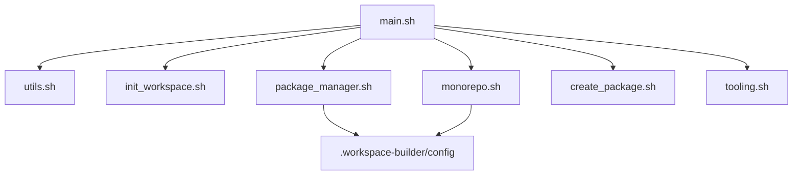

## Architecture

The CLI is composed of small, single-responsibility POSIX shell modules sourced
by a main entrypoint. Each module exposes one or more functions and avoids
side-effects when sourced.

- main.sh: argument parsing, flow orchestration, summary
- utils.sh: prompting, validation, logging, dry-run, config persistence
- init_workspace.sh: workspace initialization
- package_manager.sh: package manager selection
- monorepo.sh: workspace config writers and instructions
- create_package.sh: package/app creation scaffolds
- tooling.sh: lint/format/CI stubs

## Data flow

Inputs are collected via prompts and optional CLI flags. Selections are persisted
in .workspace-builder/config for later runs.

## Interfaces

- confirm(prompt, default) -> exit code 0 for yes
- choose(prompt, options...) -> prints numbered options, echoes choice index
- prompt_input(label, default) -> echoes input string
- init_workspace(root)
- package_manager_flow()
- monorepo_flow()
- create_package_or_app(root, name, rel_path, stack)
- tooling_flow(root)

## Error handling

| Scenario | Behavior |
| --- | --- |
| Missing external tool | Warn and skip command execution |
| Existing file/dir | Prompt to overwrite or skip |
| Invalid input | Re-prompt with reason |
| User quits | Print safe exit message and stop |
| Dry-run | Print commands and skip execution |

## Testing strategy

- Manual smoke test using dry-run mode.
- Automated idempotency test script that runs the CLI twice in a temp directory
  with deterministic inputs and verifies no unexpected changes.
